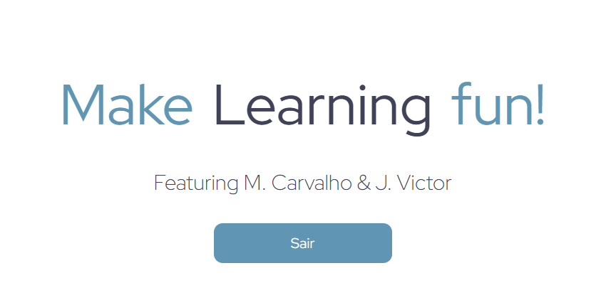

# Angular Learning Test Project

This project has took 4 hours of studiyng and coding.

Pondo em prática aprendizado que veio com o objetivo de satisfazer o objetivo requerido na sprint do projeto Capacita SmartPlay 2.0, utilizando das tecnologias menciadas.

Além disso o projeto serviu como fonte de informações para outros integrantes tirarem dúvidas acerca do conteúdo e do código feito

## Tecnologias

TypeScript

Angular 17

SCSS

Json-Server

